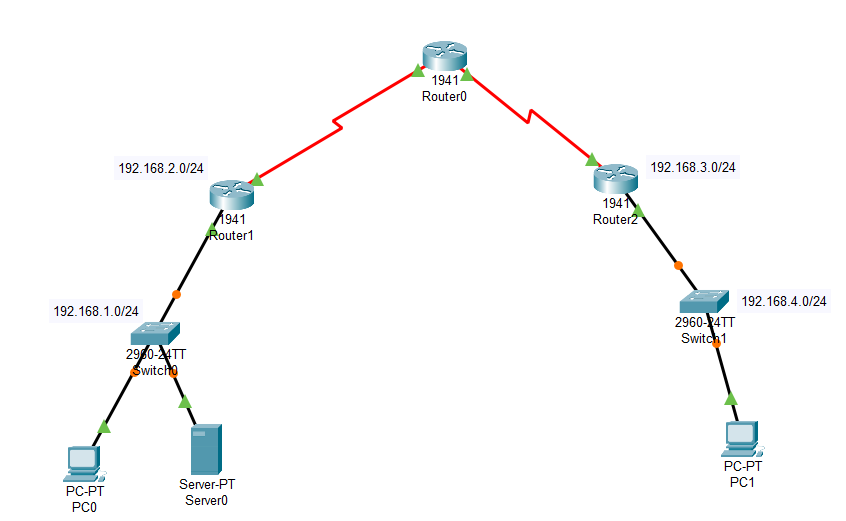
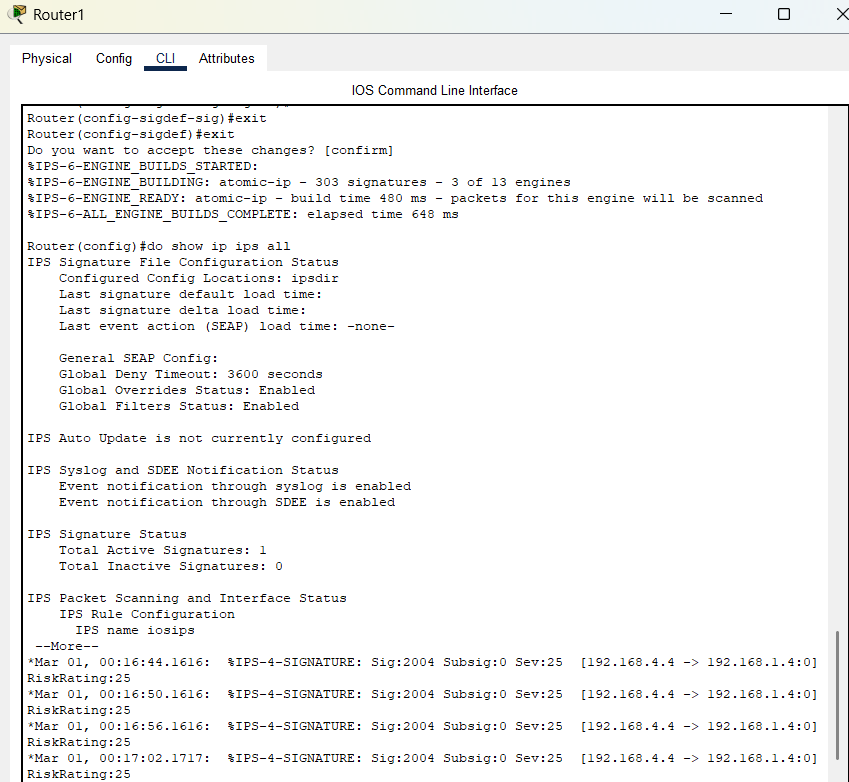
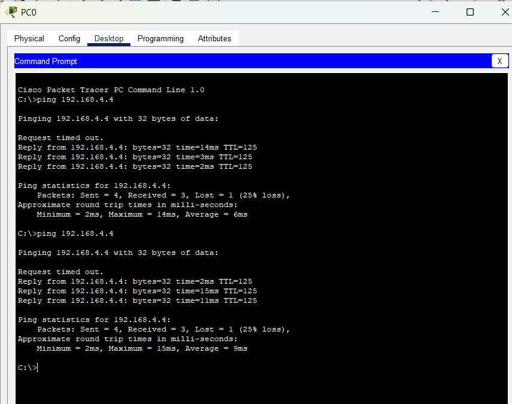
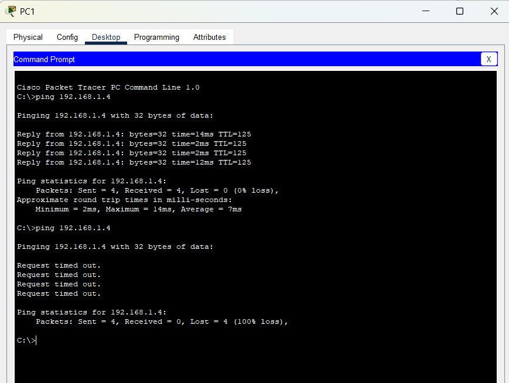
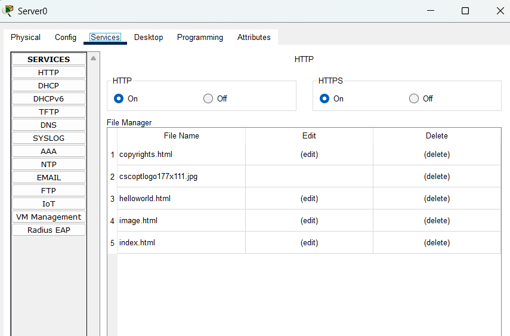

# Intrusion Detection System in Packet Tracer

## Pre-requisites:
1. **Cisco Networking Academy Account**
2. **Packet Tracer Simulation Environment**

## Step 1: Install Packet Tracer
- Download and install Packet Tracer from:
  - [NetAcad](https://www.netacad.com/resources/lab-downloads)
  - [Packet Tracer Network](https://www.packettracernetwork.com/download/download-packet-tracer.html#google_vignette)

## Step 2: Open Packet Tracer
- Launch Packet Tracer after installation.
- When prompted to log in, select "Cisco Networking Academy".
- Log in with your credentials to access the Packet Tracer environment.

## Requirements for Intrusion Detection System (IDS) Design
- **3 x 1941 Routers**
- **2 x 2960 Switches**
- **2 x PC-PT as End Devices**
- **1 x Server-PT as Intrusion Detection System**

Connect all components as shown in the provided diagram, using the "automatically choose connection type" option.



---
## Step 1: Physical Setup of Routers
1. Click on **Router 0**.
2. Choose **HWIC-2T** from the physical tab.
3. Turn off the router.
4. Drag **HWIC-2T** (a Cisco 2-Port Serial High-Speed WAN Interface Card) from below and place it on the router.
5. Turn on the router.
6. Repeat the above steps for **Router 1** and **Router 2**.

## Step 2: Label Devices
- Add textboxes near each router and switch to name their respective **IP addresses**.

## Step 3: Router Configuration
Configure routers to establish connectivity:

### **Router 1**
```
en
conf t
int gigabitEthernet 0/0
ip address 192.168.1.1 255.255.255.0
no shut
exit
int serial 0/1/0
ip address 192.168.2.1 255.255.255.0
no shut
exit
```

### **Router 0**
```
en
conf t
int serial 0/1/0
ip address 192.168.2.2 255.255.255.0
no shut
exit
int serial 0/1/1
ip address 192.168.3.1 255.255.255.0
no shut
exit
```

### **Router 2**
```
en
conf t
int serial 0/1/0
ip address 192.168.3.2 255.255.255.0
no shut
exit
int gigabitEthernet 0/0
ip address 192.168.4.1 255.255.255.0
no shut
exit
```

## Step 4: Assign IP Addresses to End Devices
### **PC0**
1. Open **Desktop > IP Configuration**.
2. Set:
   - IPv4 Address: **192.168.1.4**
   - Subnet Mask: **255.255.255.0**
   - Default Gateway: **192.168.1.1**

### **PC1**
1. Open **Desktop > IP Configuration**.
2. Set:
   - IPv4 Address: **192.168.4.4**
   - Subnet Mask: **255.255.255.0**
   - Default Gateway: **192.168.4.1**

## Step 5: Automating Routing Using RIP (Routing Information Protocol)
### **Router 1**
```
Router(config)# router rip
Router(config-router)# network 192.168.1.0
Router(config-router)# network 192.168.2.0
exit
exit
show ip route
```

### **Router 0**
```
Router(config)# router rip
Router(config-router)# network 192.168.3.0
Router(config-router)# network 192.168.4.0
exit
exit
show ip route
```

### **Router 2**
```
Router(config)# router rip
Router(config-router)# network 192.168.2.0
Router(config-router)# network 192.168.3.0
exit
exit
show ip route
```

## Step 6: Configure Server for IDS
1. Open **Server-PT > IP Configuration**.
2. Set:
   - IPv4 Address: **192.168.1.50**
   - Subnet Mask: **255.255.255.0**
   - Default Gateway: **192.168.1.1**
3. Ensure **Syslog Services** is turned **ON**.

## Step 7: Verify Network Connectivity
1. **Check connectivity between PC1 and PC0**:
   - Open **PC0 > Desktop > Command Prompt**
   - Type: `ping 192.168.4.4`
   - Response should be **successful**.

2. **Check connectivity between PC1 and PC0 in reverse**:
   - Open **PC1 > Desktop > Command Prompt**
   - Type: `ping 192.168.1.4`
   - Response should be **successful**.

## Step 8: Installing IPS (Intrusion Prevention System)
### **Router 1**
```
show version
conf t
license boot module c1900 technology-package securityk9
accept
reload
mkdir ipsdir
conf t
ip ips config location ipsdir
ip ips name iosips
ip ips signature-category
category all
retired true
exit
exit
category ios_ips basic
retired false
exit
confirm
Router(config)# interface gigabitEthernet 0/0
ip ips iosips out
exit
logging host 192.168.1.50
service timestamps log datetime msec
ip ips signature-definition
signature 2004 0
status
retired false
enabled true
exit
engine
event-action produce-alert
event-action deny-packet-inline
exit
exit
exit
do show ip ips all
```

### After configuration of rules



## Expected Results
- When you **ping PC0 from PC1**, you **get a reply**.
  
-ping 192.168.4.4  # You will get a reply



- When you **ping from outside network (PC1) to inside network (PC0)**, you **do not get a reply**.

-ping 192.168.1.4  # Request timed out or no reply



### Syslog entries



## Conclusion
You have successfully configured an Intrusion Detection System (IDS) using **Packet Tracer**. The setup ensures **secure communication** within the allowed network and **blocks unauthorized access** from external networks using IPS.


